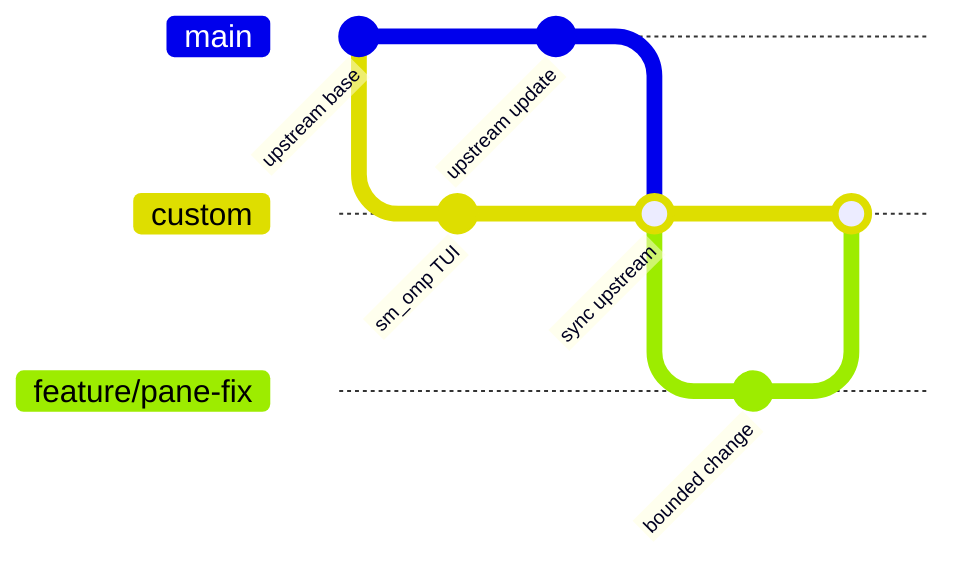

# sm_omp Fork Maintenance

This document defines how `Mengrendufu/sm_omp` tracks
`can1357/oh-my-pi` while preserving the custom TUI. It is the operational
source of truth for remotes, branches, upstream synchronization, validation,
release tags, and rollback.

For architectural ownership and the TUI-only customization boundary, also see
[`AGENTS.md`](../AGENTS.md). For semantic ports from the older `pi-mono`
lineage, see [`porting-from-pi-mono.md`](./porting-from-pi-mono.md); that guide
does not replace this fork workflow.

## Repository topology

| Name | URL | Role | Push policy |
| --- | --- | --- | --- |
| `origin` | `git@github.com:Mengrendufu/sm_omp.git` | This maintained fork | Push `main`, `custom`, feature branches, and release tags |
| `upstream` | `https://github.com/can1357/oh-my-pi.git` | Official OMP source | Never push; fetch only |

Configure or repair the remotes from the repository root:

```bash
git remote set-url origin git@github.com:Mengrendufu/sm_omp.git
git remote get-url upstream >/dev/null 2>&1 || git remote add upstream https://github.com/can1357/oh-my-pi.git
git remote set-url upstream https://github.com/can1357/oh-my-pi.git
git remote set-url --push upstream DISABLED
git fetch origin --prune --tags
git fetch upstream --prune --tags
```

`git remote -v` must show a disabled `upstream` push URL. Never replace it with
a writable URL.

## Branch contract

| Branch | Owner | Invariant | Normal incoming changes |
| --- | --- | --- | --- |
| `main` | Upstream mirror | Exactly follows `upstream/main`; contains no sm_omp-only commits | Fast-forward from `upstream/main` only |
| `custom` | sm_omp product | Default and releasable TUI-customized branch | Reviewed feature branches and merges from `main` |
| `feature/*` | Short-lived work | One bounded customization or fix | Branch from `custom`; merge back to `custom` |



Hard rules:

1. Do not commit custom behavior directly to `main`.
2. Do not merge `custom` or `feature/*` into `main`.
3. Branch new customization work from `custom`, not `main`.
4. Merge official updates from `main` into `custom`; never rebase published
   `custom` history onto upstream.
5. Keep `custom` as the GitHub default branch.

## Custom change workflow

Start from an up-to-date `custom` branch:

```bash
git switch custom
git pull --ff-only origin custom
git switch -c feature/<short-name>
```

Implement and verify the bounded change. Then merge it without rewriting
published history:

```bash
git switch custom
git merge --no-ff feature/<short-name>
```

Delete the feature branch only after its merge commit and verification are
recorded. Pull requests for sm_omp customization target `custom`.

## Synchronizing official OMP updates

### Preconditions

- The worktree is clean.
- `main` has no local-only commit.
- `upstream` still points to `can1357/oh-my-pi` and has push disabled.
- The current `custom` tip is recoverable from a local branch or tag.

### Update the mirror branch

```bash
git fetch upstream --prune --tags
git switch main
git merge --ff-only upstream/main
git push origin main
```

If `--ff-only` fails, stop. `main` has diverged and must not be repaired by
merging. Preserve the unexpected tip, then realign only after reviewing it:

```bash
git branch backup/main-diverged-YYYYMMDD
git reset --hard upstream/main
```

### Integrate the update into sm_omp

```bash
git switch custom
git merge --no-ff main -m "chore: sync upstream <upstream-short-sha>"
```

A merge commit is intentional: it records the exact upstream integration
boundary and keeps the customization lineage inspectable. Do not use a squash
merge for upstream synchronization.

### Synchronization acceptance policy

`sm_omp` is a TUI-layout fork, not a parallel Agent Runtime. The acceptance
standard for an upstream synchronization is **official-baseline equivalence plus
custom-TUI correctness**, not a completely green upstream repository:

1. Treat the target official revision as authoritative for agent, provider,
   tool, session, and other non-TUI runtime semantics. Import those changes
   instead of repairing or reimplementing them in `custom`.
2. Block publication for a regression introduced by the merge, accidental
   non-TUI divergence from the target official revision, or a failure of the
   accepted sm_omp TUI contracts.
3. Do not block publication solely because the target official revision has the
   same failing test or known defect. Reproduce the same failure signature on a
   clean checkout of that revision when practical.
4. A pre-merge `custom` baseline can prove that a failure was not introduced by
   the synchronization, but it must not justify preserving behavior that the
   target official revision fixed.
5. A missing optional test or build dependency is an infrastructure gap, not a
   product regression. Record the exact missing command or dependency instead
   of changing product code to make the check disappear.
6. Record every accepted upstream-baseline failure and infrastructure gap in
   the merge or release notes. Fix it only as separately approved work; do not
   expand an upstream synchronization into Agent Runtime maintenance.

The resulting `custom` tree may therefore retain failures present in the target
official baseline. It must not add failures attributable to sm_omp integration,
and its customized TUI must remain usable and verified.

## Conflict policy

Never resolve an upstream synchronization with a blanket `--ours` or
`--theirs`. Resolve each conflict by semantic ownership:

1. Identify the upstream behavior change and the sm_omp customization it
   intersects.
2. Preserve upstream behavior outside the TUI and its necessary application
   assembly.
3. Preserve the accepted sm_omp TUI contracts: fixed Input geometry,
   independently scrollable Conversation and Sidebar viewports, alternate-screen
   repaint isolation, pane focus/navigation, and terminal restoration.
4. Reconcile renamed APIs and moved assembly points instead of restoring stale
   files wholesale.
5. Update tests when the observable contract changes.
6. If ownership, dependency direction, state ownership, or runtime assembly
   changes, update the authoritative UML model named in `AGENTS.md` before
   completing the merge.
7. If code, tests, repository rules, and UML disagree, stop the merge and resolve
   the architecture mismatch explicitly.

Useful review commands:

```bash
git diff --name-status custom...main
git diff custom...main -- packages/tui packages/coding-agent/src/modes
git diff --check
```

## Verification gate

An upstream synchronization is ready to publish when the target official commit
is integrated, no new sm_omp-caused regression remains, and the customized TUI
passes its automated and interactive checks. Broader upstream checks are
diagnostic comparisons; they are not required to become green when the target
official baseline has the same failures.

### Required automated checks

```bash
(cd packages/tui && bun test test/panes.test.ts test/fullscreen.test.ts test/mouse.test.ts)
(cd packages/tui && bun run check:types)
(cd packages/coding-agent && bun test test/interactive-mode-editor-component.test.ts test/settings-manager.test.ts test/status-line-model.test.ts)
(cd packages/coding-agent && bun run check:types)
git diff --check
```

Add narrower regression tests for any upstream conflict or changed observable
TUI contract. Run broader package or repository checks when synchronized files
extend beyond the TUI boundaries, then classify each failure:

- A failure introduced only in merged `custom` blocks publication.
- A matching failure on the target official revision is accepted upstream
  baseline when it does not worsen in `custom`.
- A pre-merge-only failure requires review; do not carry it forward when the
  target official revision fixed it.
- A check that cannot start because an optional tool is unavailable is recorded
  as an infrastructure gap.

Use isolated worktrees when a failure signature must be compared without module
resolution or generated artifacts leaking between revisions.

### Required interactive smoke test

Start the customized CLI and verify:

1. Conversation scrolls independently while Input stays fixed.
2. Long framed tool output leaves no stale glyphs or backgrounds while scrolling.
3. Sidebar scrolling and focus do not move or replace the Input draft.
4. Page, line, half-page, first, and last navigation reach the expected rows.
5. Exiting restores the normal terminal screen, cursor, mouse tracking, and
   autowrap modes.

Record the upstream SHA, merge commit, commands run, and smoke-test result in the
merge or release notes.

## Release tags

Releases are cut from a clean `custom` tip verified under the synchronization
acceptance policy. Each annotated tag follows the official OMP base tag and
adds the suffix `-sm.N`:

```text
v<upstream-version>-sm.<N>
```

`sm` identifies the `sm_omp` personal customization and `N` starts at `1` for
each official base version. For example, the first customized release based on
official `v17.2.15` is `v17.2.15-sm.1`; another frozen snapshot on the same base
is `v17.2.15-sm.2`, while the first snapshot after updating to official
`v17.2.16` is `v17.2.16-sm.1`.

```bash
git switch custom
git status --short
git describe --tags --exact-match main
git tag -a v17.2.15-sm.1 \
  -m "sm_omp personal customization based on official OMP v17.2.15"
git push --atomic origin custom refs/tags/v17.2.15-sm.1
```

The official base tag must already identify `main`; never recreate or move it
on `custom`. A customized tag identifies an exact rollback point. Do not tag
`main` as an sm_omp release, do not create mutable `latest` aliases, and do not
move an existing release tag.

A completely green broader repository suite is not a prerequisite for a
customized tag when failures match the target official baseline or checks are
blocked by recorded optional infrastructure gaps. The custom TUI checks and
interactive smoke test remain mandatory. Include accepted failure signatures,
missing dependencies, the official SHA, and the merge commit in the tag,
merge, or release notes.

## Rollback

Prefer history-preserving rollback after a commit has been shared:

```bash
git switch custom
git revert <bad-commit-or-merge>
```

For a merge commit, select the `custom` parent as the mainline after inspecting
its parents:

```bash
git show --no-patch --pretty=%P <bad-merge>
git revert -m 1 <bad-merge>
```

Before any unpublished destructive recovery, create a backup branch. Published
`custom` history must not be force-pushed.

## Synchronization checklist

- [ ] Worktree clean; current `custom` tip recoverable.
- [ ] `origin` is `Mengrendufu/sm_omp`.
- [ ] `upstream` is `can1357/oh-my-pi` with push disabled.
- [ ] `main` fast-forwarded to `upstream/main` without custom commits.
- [ ] `origin/main` updated.
- [ ] `main` merged into `custom` with an explicit merge commit.
- [ ] Conflicts resolved semantically; no blanket side selection.
- [ ] Non-TUI runtime behavior follows the target official revision.
- [ ] Every broader-suite failure classified against the target official and
      pre-merge custom baselines.
- [ ] No new failure attributable to sm_omp integration remains.
- [ ] Accepted upstream failures and infrastructure gaps recorded.
- [ ] UML updated when architecture changed.
- [ ] Required custom-TUI tests and type checks passed.
- [ ] Interactive TUI smoke test passed.
- [ ] Release tag created only from a tip verified under this acceptance policy.
