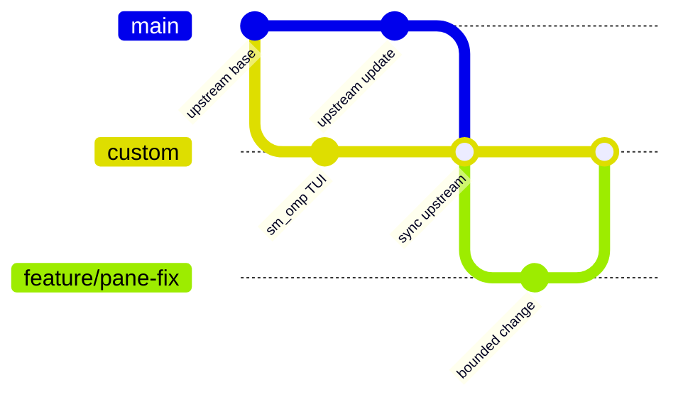

# sm_omp Fork Maintenance

This document defines how `Mengrendufu/sm_omp` tracks
`can1357/oh-my-pi` while preserving the custom TUI. It is the operational
source of truth for remotes, branches, upstream synchronization, validation,
release tags, and rollback.

For architectural ownership and the TUI-only customization boundary, also see
[`AGENTS.md`](../AGENTS.md). For semantic ports from the older `pi-mono`
lineage, see [`porting-from-pi-mono.md`](./porting-from-pi-mono.md); that guide
does not replace this fork workflow.

## Repository topology

| Name | URL | Role | Push policy |
| --- | --- | --- | --- |
| `origin` | `git@github.com:Mengrendufu/sm_omp.git` | This maintained fork | Push `main`, `custom`, feature branches, and release tags |
| `upstream` | `https://github.com/can1357/oh-my-pi.git` | Official OMP source | Never push; fetch only |

Configure or repair the remotes from the repository root:

```bash
git remote set-url origin git@github.com:Mengrendufu/sm_omp.git
git remote get-url upstream >/dev/null 2>&1 || git remote add upstream https://github.com/can1357/oh-my-pi.git
git remote set-url upstream https://github.com/can1357/oh-my-pi.git
git remote set-url --push upstream DISABLED
git fetch origin --prune --tags
git fetch upstream --prune --tags
```

`git remote -v` must show a disabled `upstream` push URL. Never replace it with
a writable URL.

## Branch contract

| Branch | Owner | Invariant | Normal incoming changes |
| --- | --- | --- | --- |
| `main` | Upstream mirror | Exactly follows `upstream/main`; contains no sm_omp-only commits | Fast-forward from `upstream/main` only |
| `custom` | sm_omp product | Default and releasable TUI-customized branch | Reviewed feature branches and merges from `main` |
| `feature/*` | Short-lived work | One bounded customization or fix | Branch from `custom`; merge back to `custom` |



Hard rules:

1. Do not commit custom behavior directly to `main`.
2. Do not merge `custom` or `feature/*` into `main`.
3. Branch new customization work from `custom`, not `main`.
4. Merge official updates from `main` into `custom`; never rebase published
   `custom` history onto upstream.
5. Keep `custom` as the GitHub default branch.

## Custom change workflow

Start from an up-to-date `custom` branch:

```bash
git switch custom
git pull --ff-only origin custom
git switch -c feature/<short-name>
```

Implement and verify the bounded change. Then merge it without rewriting
published history:

```bash
git switch custom
git merge --no-ff feature/<short-name>
```

Delete the feature branch only after its merge commit and verification are
recorded. Pull requests for sm_omp customization target `custom`.

## Synchronizing official OMP updates

### Preconditions

- The worktree is clean.
- `main` has no local-only commit.
- `upstream` still points to `can1357/oh-my-pi` and has push disabled.
- The current `custom` tip is recoverable from a local branch or tag.

### Update the mirror branch

```bash
git fetch upstream --prune --tags
git switch main
git merge --ff-only upstream/main
git push origin main
```

If `--ff-only` fails, stop. `main` has diverged and must not be repaired by
merging. Preserve the unexpected tip, then realign only after reviewing it:

```bash
git branch backup/main-diverged-YYYYMMDD
git reset --hard upstream/main
```

### Integrate the update into sm_omp

```bash
git switch custom
git merge --no-ff main -m "chore: sync upstream <upstream-short-sha>"
```

A merge commit is intentional: it records the exact upstream integration
boundary and keeps the customization lineage inspectable. Do not use a squash
merge for upstream synchronization.

## Conflict policy

Never resolve an upstream synchronization with a blanket `--ours` or
`--theirs`. Resolve each conflict by semantic ownership:

1. Identify the upstream behavior change and the sm_omp customization it
   intersects.
2. Preserve upstream behavior outside the TUI and its necessary application
   assembly.
3. Preserve the accepted sm_omp TUI contracts: fixed Input geometry,
   independently scrollable Conversation and Sidebar viewports, alternate-screen
   repaint isolation, pane focus/navigation, and terminal restoration.
4. Reconcile renamed APIs and moved assembly points instead of restoring stale
   files wholesale.
5. Update tests when the observable contract changes.
6. If ownership, dependency direction, state ownership, or runtime assembly
   changes, update the authoritative UML model named in `AGENTS.md` before
   completing the merge.
7. If code, tests, repository rules, and UML disagree, stop the merge and resolve
   the architecture mismatch explicitly.

Useful review commands:

```bash
git diff --name-status custom...main
git diff custom...main -- packages/tui packages/coding-agent/src/modes
git diff --check
```

## Verification gate

An upstream sync or TUI customization is not ready to publish until all
applicable checks pass from the merged `custom` tree.

### Required automated checks

```bash
(cd packages/tui && bun test test/panes.test.ts test/fullscreen.test.ts test/mouse.test.ts)
(cd packages/tui && bun run check:types)
(cd packages/coding-agent && bun test test/interactive-mode-editor-component.test.ts test/settings-manager.test.ts test/status-line-model.test.ts)
(cd packages/coding-agent && bun run check:types)
git diff --check
```

Add narrower regression tests for any upstream conflict or changed observable
contract. Run broader package tests when the synchronized files extend beyond
these TUI boundaries.

### Required interactive smoke test

Start the customized CLI and verify:

1. Conversation scrolls independently while Input stays fixed.
2. Long framed tool output leaves no stale glyphs or backgrounds while scrolling.
3. Sidebar scrolling and focus do not move or replace the Input draft.
4. Page, line, half-page, first, and last navigation reach the expected rows.
5. Exiting restores the normal terminal screen, cursor, mouse tracking, and
   autowrap modes.

Record the upstream SHA, merge commit, commands run, and smoke-test result in the
merge or release notes.

## Release tags

Releases are cut from a clean, verified `custom` tip. Use annotated tags of the
form `sm-omp-vYYYY.MM.DD.N`, where `N` starts at `1` for each date:

```bash
git switch custom
git status --short
git tag -a sm-omp-vYYYY.MM.DD.N -m "sm_omp YYYY.MM.DD.N"
git push origin custom
git push origin sm-omp-vYYYY.MM.DD.N
```

A tag identifies the exact rollback point. Do not tag `main` as an sm_omp
release and do not move an existing release tag.

## Rollback

Prefer history-preserving rollback after a commit has been shared:

```bash
git switch custom
git revert <bad-commit-or-merge>
```

For a merge commit, select the `custom` parent as the mainline after inspecting
its parents:

```bash
git show --no-patch --pretty=%P <bad-merge>
git revert -m 1 <bad-merge>
```

Before any unpublished destructive recovery, create a backup branch. Published
`custom` history must not be force-pushed.

## Synchronization checklist

- [ ] Worktree clean; current `custom` tip recoverable.
- [ ] `origin` is `Mengrendufu/sm_omp`.
- [ ] `upstream` is `can1357/oh-my-pi` with push disabled.
- [ ] `main` fast-forwarded to `upstream/main` without custom commits.
- [ ] `origin/main` updated.
- [ ] `main` merged into `custom` with an explicit merge commit.
- [ ] Conflicts resolved semantically; no blanket side selection.
- [ ] UML updated when architecture changed.
- [ ] Required tests and type checks passed.
- [ ] Interactive TUI smoke test passed.
- [ ] Release tag created only when publishing a verified version.
